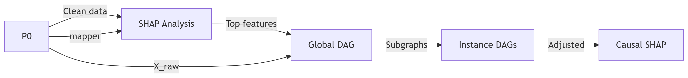
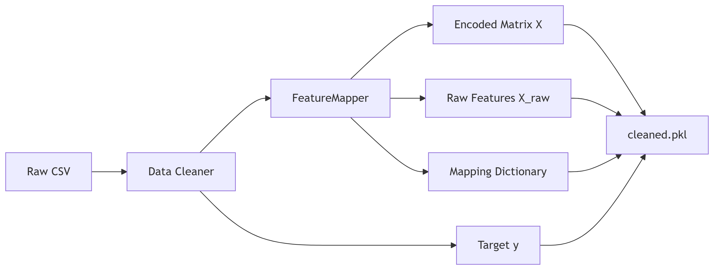
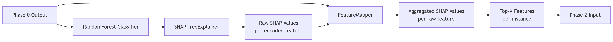
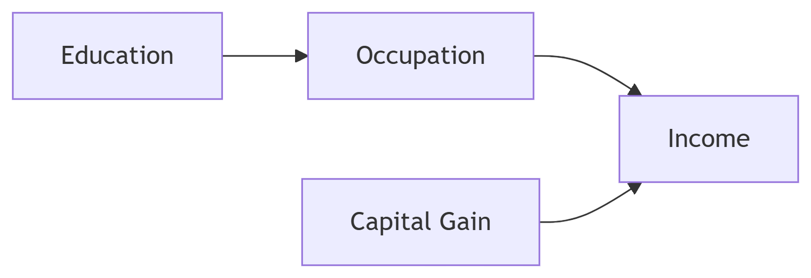
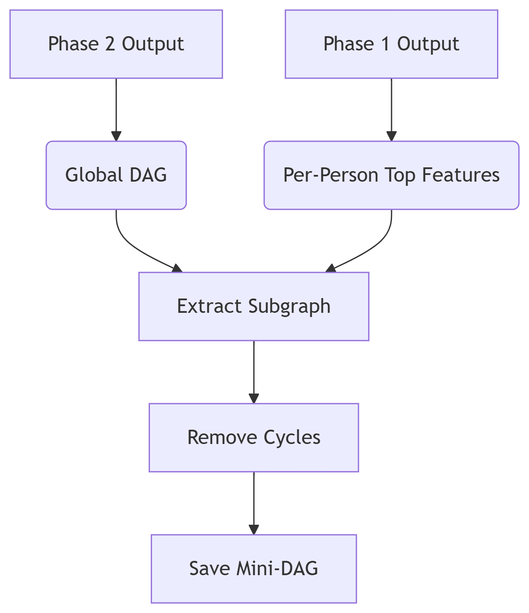
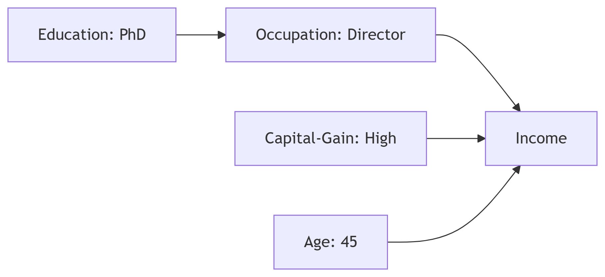
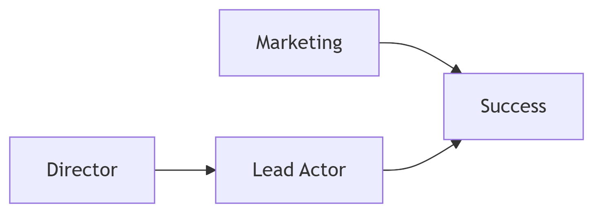

# InstanceLevel_Casual_SHAP

 Problem Addressed
Standard explanation methods (e.g., SHAP) reveal feature importance but conflate correlation with causation. This leads to:

Misguided interventions (e.g., "Work longer hours!" instead of "Get a degree")

Failure to identify root causes

Our Solution
CausalSHAP integrates local explainability (SHAP) with causal discovery (NOTEARS) to:

Identify root causes behind predictions

Demote mediator features (e.g., occupation between education and income)

Personalize explanations via instance-specific causal graphs

PHASES:

PHASE 0:

used pandas to read , process data, handled missing data and save it as a csv file

Converted the income target from strings ('>50K' or <=50K') to binary labels (1 or 0).

using one hot encoding created many features because  using it created so many features so USED FEEATURE MAPPER

# todo
for feature scaling (z score normalization or min max scaling)

used feature mapper to map raw features to encoded features

REFERENCES
raw data --> https://ryanwingate.com/projects/machine-learning-data-prep/adult/adult-cleaning/
for handling missing data --> https://aniket-mishra.github.io/projects/Adult-UCI-Dataset-Analysis.html
about encoding --> https://medium.com/%40KhushiBhadange/how-to-automate-data-cleaning-and-preprocessing-in-python-a-comprehensive-guide-d0ed622c6a62

PHASE 1:
used encoded features and binary income label to train a Random Forest model

random forest is believed to handle mixed data types well
# todo 
xgboost or lightgbm

used shap TreeExplainer (used for tree based models)to get per instance feature attributions

each shap value denote the importance of a feature for a particular instance

WE WILL BE SELECTING TOP K FEATURES Per Row FOR OUR PROJET TO MAKE IT COMPUTATIONALLY EFFICIENT

Aggregating SHAP scores to raw features prevents feature explosion and makes analysis intuitive.

REFERENCES:
https://medium.com/data-reply-it-datatech/explainable-ai-shap-values-1c7128ef06c2
https://www.kaggle.com/code/vikumsw/explaining-random-forest-model-with-shapely-values

PHASE 2:

Learned a global causal graph (Directed Acyclic Graph, DAG) among the top‑8 features identified using SHAP

used NOTEARS algorithm (continuous optimization)
- it doesnt use  combinatorial search(trying every possible ways), it uses a continuous optimization algorithm to find the optimal DAG
 infered causal edges and directionality from the encoded test data subset.
 Converts categorical columns into integer codes via ordinal_encode, preparing data for NOTEARS (which requires numeric input)
w_threshold=0.3 is used to remove edges that are not significantly correlated with the SHAP values

REFERENCES:
https://www.researchgate.net/publication/387262428_NOTEARS-M_Causal_Bayesian_Network_Structure_Learning_of_Mixed_Type_Data_and_Its_Application_in_Identifying_Disease_Risk_Factors

PHASE 3:

instance specific causal graph (Directed Acyclic Graph, DAG) among the top‑8 features identified using SHAP
Individual causal graphs improve actionability over population-level explanations

REFERENCES:
https://causalnex.readthedocs.io/en/latest/genindex.html

PHASE 4:
Causal Aware SHAP Adjustment per instance.
Now we have raw shap values and instance specific causal graphs, we can use them to compute causal SHAP adjustment per instance.

for each feature in instance specific DAG, we calculate in_degree of the feature(to measure how many other feature causally influence the feature for that individual)
we look for indegree of each feature in the instance specific DAG and compute the SHAP value of the feature as:
we normalized so sum of the adjusted SHAP values equals the sum of the raw SHAP for comparability—so the total attribution remains consistent.

SHAP_raw * (1 + alpha * in_degree)

where alpha is a hyperparameter that controls the strength of the adjustment
alpha = 0.5 is used in the paper

here, boosts director (in-degree=0) and marketing (in-degree=0) and reduces actor credit (in-degree=1)
REFERENCES:
https://christophm.github.io/interpretable-ml-book/shapley.html
https://proceedings.mlr.press/v108/janzing20a/janzing20a.pdf

PHASE 5:
Synthetic Validation
nodes,edge_prob,n_samples,noise_std,pct_keep,raw_edges,pruned_edges,directed_precision,directed_recall,directed_f1,skeleton_precision,skeleton_recall,skeleton_f1
8,0.25,20000,0.3,30.0,56,56,0.10714285714285714,1.0,0.19354838709677416,0.21428571428571427,1.0,0.35294117647058826
# todo 
rerun with parameters tuning for better performance, its pretty low than expected

REFERENCES
https://arxiv.org/abs/1711.00083

PHASE 6:
Counter Factual Evaluation
Measuring flip rate and edit distance tests whether explanations are truly helpful
# need to use robust parameters for increasing flips

REFERENCES
https://arxiv.org/html/2503.04463v1
